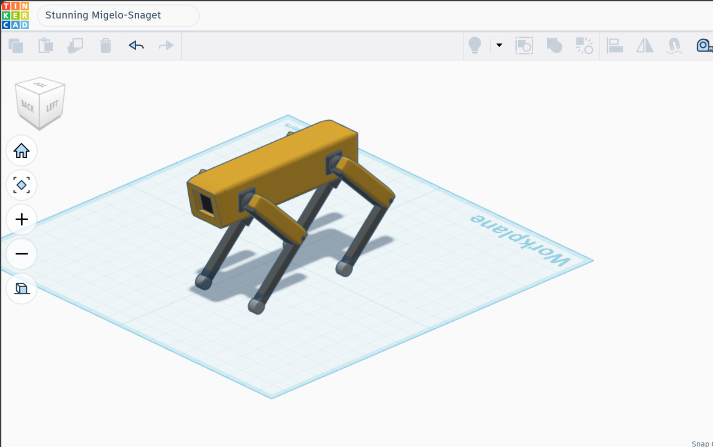
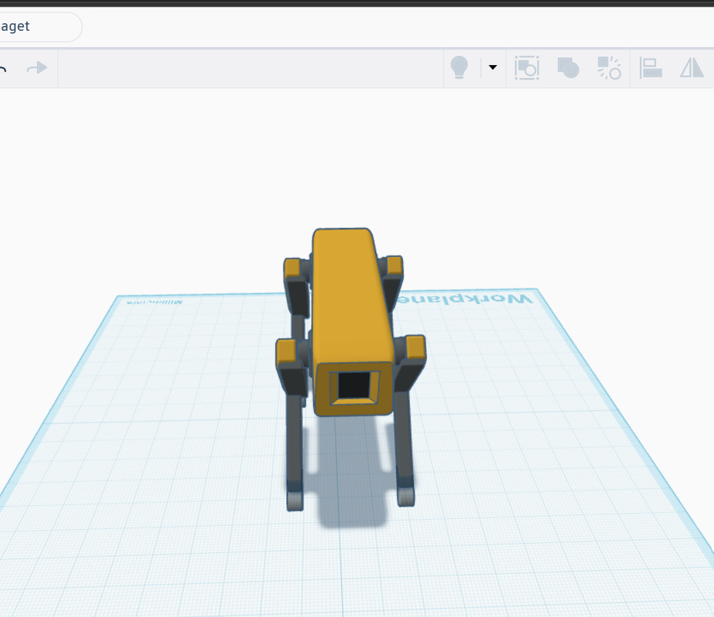
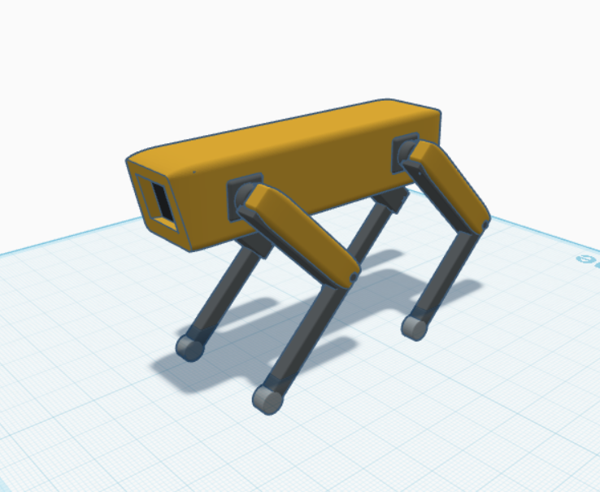
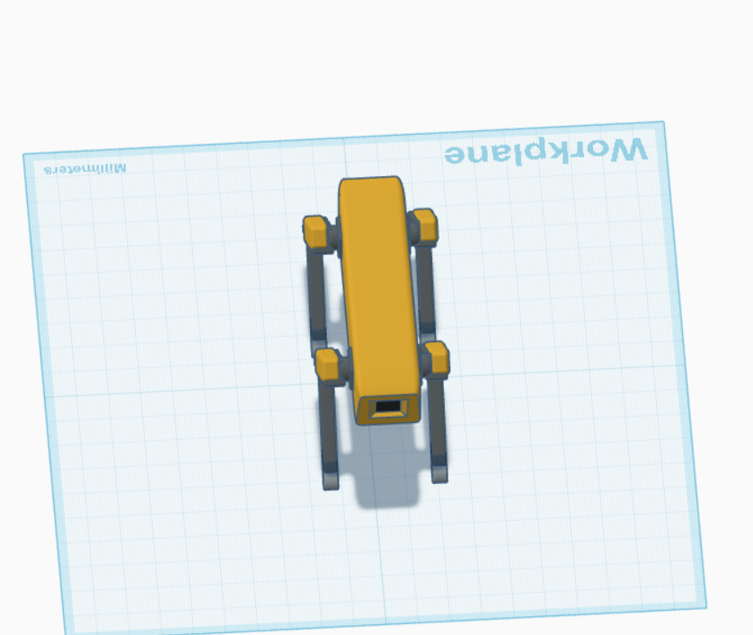

# robot-dog-mechanical-design
# 🤖 Robot Dog Mechanical Design

## Overview
This project presents the initial mechanical design of a simple quadruped robot using Tinkercad. The project focuses on understanding the basic mechanical principles required to design a robot capable of standing and walking.

## Objectives
- Design the robot body and frame.
- Design the robot legs.
- Define the joints and Degrees of Freedom (DOF).
- Select suitable motors.
- Estimate the required joint torque.
- Analyze stability and center of gravity.
- Propose a walking method.

## Tools Used
- Tinkercad
- GitHub
- Microsoft Word

## Project Structure

```
robot-dog-mechanical-design/
│
├── images/
├── report/
└── README.md
```
## Robot Design

### Perspective View


### Front View


### Side View


### Top View


## Author
**Layal Aljohani**
